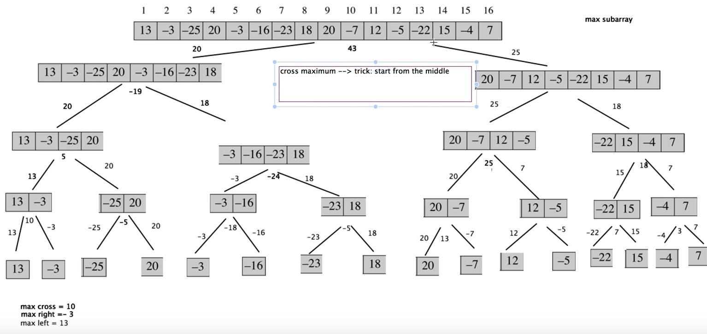

### Time 80 min

### Method 1 - O(n) one pass (not working)
Accumulate the array (get cdf), find the min and max of cdf. The difference of the min and max is the largest
sum. Counter-example: Well, what about a monotonically decreasing case? 

### Method 2 - Built on top of Method 1
- When there's one letter, you return the letter; 
- When the vector monotonically decreases, you return the max among all of them. 
- When there are ups and downs, you do not just record the historical min and max cdf, because max might occur after min.
Instead, you always update the differencerence. Therefore, you keep a record of the historical min cdf, 
    1. if the current cdf <  historical min  cdf, update the latter
    2. else, see if (current_cdf - historical min) > largest_diff; if yes, update. 
    3. There is an exception, where the largest difference is the sum of all numbers. This cannot be covered by the previous two cases, 
    because you need historical_min to be 0, which may not be the case. 
    4. There is also another exception: nums = [-2, 1]. **BUT this can be covered by the first case** - have historical_cdf start at nums.at(0), 
    then current_cdf - historical cdf will reflect individual elements.  
   

### Method 3 Divide and Conquer
To divide, read the image from the top to the bottom. To conquer, read the image from the bottom to the top. 

So we get the largest sum of a subarray, by evaluating the left sum, the right sum, and the sum across the middle element.
This way, we evaluate all the possibilities. 
    - To get the max of the left and right sub-arrays, we can do it in a recursive way. 
    - To get the max across the middle element, we need to start from the middle, expand to the right and to the left. Of course, you
    need two for loops to iterate thru those elements.  **Well, this is not the most efficient way to do it.** A more efficient way to do this 
    is to get the max sum, then get the right sum. 
 
####More details: 
1. when we have only 1 element, max left/right should return the element. 
When we have 2 elements, for max_middle element, the middle is the left element. So its left sum should be 0/left_element, 
depending on if you choose to include the left element.   
  
2. we can use close boundaries [], instead of [)  

### Notes
1. Software engineering is really, getting the basic algorithm -> test with corner cases -> test with possible
extreme cases. Without these, your algorithms might be flawed. So **take your time and test your algo.**

