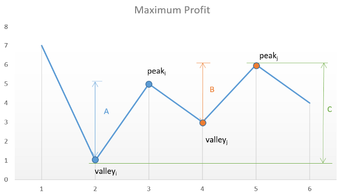

### Time 20 min

[7,1,5,3,6,4] => [1,5], [3,6]
[7,1,2,3,6,4] => [1,6]
### Method 1 Brute force
For a certain element, iterate thru all subsequent larger elements. if they're larger, repeat this step to 
find the max benefit. 
[1,5] + [3,6] vs [1,3] vs [1,6] vs [1,4]
[5,6]
[3,6] vs [3,4]
[6,4]

### Dynamic Programming
buy:4, sell -1, best_start = 4
buy 6: sell: -1, best_start = 6
buy: 3, sell: 6,4, best is 3,6. best_start = 3
buy 5: no element > 5 before best start and 5 > best_start. So 5 cannot be chosen. 
buy 1: before best_start, 5>1; [1,5] + best_start sequence; best_start = 1. ... 
The logic is quite complicated, not recommended for implementation 

### Dynamic Programming Flavor 2
Since you can buy and sell at the same price, at each price, you first decide on whether to buy it. After
you make a decision, you decide on whether or not you sell the stock you have at hand. 

profit_with_stock_in_hand (profit you have if you always have one stock in hand)= max[profit_with_stock_at_hand (the old value if you didn't sell anything), profit_after_selling_my_stock - current_price]
profit_after_selling_my_stock = [profit_after_selling_my_stock, profit_with_stock_at_hand + current_price]

This is still Peak Valley: once you hit a valley, you buy. Once you hit an increase, you sell. 
 
### Peak Valley :    
You can buy and sell at the same time!! So, you can count peaks from the same spot as the valley. 

