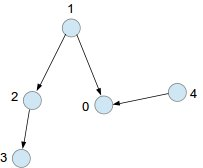
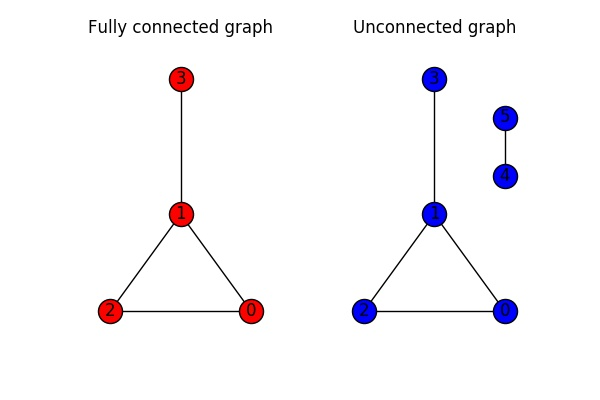

### Time 20 min

### Method 1 Topological Sort

#### Example 1 - Acyclic Graph



In this problem, we apply topological sort. Imagine we start with a 2D graph, and when a node leads to multiple nodes, 
we trace down each path one by one. So we first use DFS to trace down 1 -> 2 -> 3, then we are going to trace down 1 -> 0. 
Note that 0 depends on 4. But don't worry about it for now, read on. After we find paths start with node 1, and all the subsequent paths, 
we mark all the nodes visited. Then, we find paths starting with nodes 2, 3, but they are already visited. Then, we find 4. That's when we find the other path that leads to 0. 

#### Example 2 - Cyclic Graph
Now we have a problem: what if there is a cycle? Let's say we have 3 nodes 0,1,2 that consist a cycle 
Since we are tracing using DFS, we will keep marking nodes **"Being visited"** until we go back to the start of the cycle. 
What if node 1 leads to node 3, which is a valid path? Well, this can be done using a subtle method: 
1. we first check if a node is in a cycle
2. if it is, we explore its other child paths. 
3. After we find other paths, we mark this node "visited".

**This method is wrong, since 2 -> 0 -> 1 -> 3 will be a valid path, but 2->0->1 is a loop!** Therefore, as long as you have a loop, you should ditch the whole chain.  



So using this method, we will mark 0,1,2,3 "visited" after we find all its child paths and the cycle itself. 

#### Final Step
The final thing is to represent paths, following their dependency order.  How? 
We first simply push each *Valid* node into a stack, then finally reverse the stack order, since DFS push the bottom nodes first.  
This is valid because 
1. At a node if you have other divergence paths, all the later nodes will come after this node. Does the order of subpaths matter the current node? No
2. If you have a cycle, then you simply add their valid subpaths, and you will not add the cycle nodes. 
   
**Because in a graph, whether or not a standalone node or a connected nodes, can either have a cycle, or an end.**


### Notes
Implementation 
Example 1
```
[second_course first_course]
[[1,0],[2,0],[3,1],[3,2]] 

Adjacency matrix for next connectivity
    0: 1,2
    1: 3
    2: 3
    3: null    
``` 

