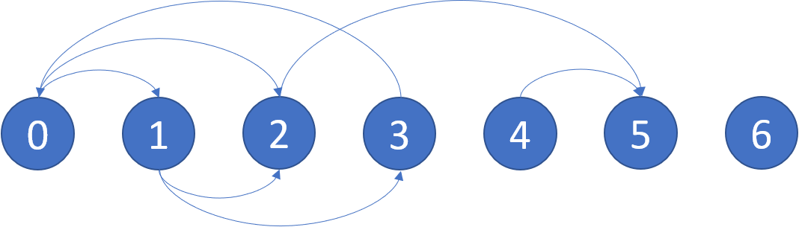

### Time 100 min

### Method 1 Topoligical Sort
It is similar to topological sort, where you build an edge list with all outbound edges, then you do DFS
to trace down every single path. If there is a cycle, you return. 

The time complexity is O(N + E), because at each node, you go over all the edges from a node, then you won't evaluate that node again. 

### Method 2 
You build 2 edge lists, one with inbound edges and one with outbound edges.  Then, you delete edges in the outbound edge list, from all the "leaf nodes". 
When you're done with all edges that can trace back to the leaf nodes, you see if there are any edge left. 
Time complexity: O(N + E) N is for traversing thru all nodes, E is number of edges. 