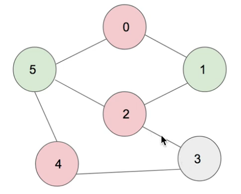

### Time 40 min

### Method 1 - one pass (not working)
This is an interesting train of thoughts: you put elements in 0,1, if they haven't been evaluated before. 
If one of them has been evaluated, and one has not, make them in different groups. 
Otherwise, if two items belong to the same group, return false. 

This method works most of the time. But consider the below case
```
[[7,8],[10,9], [10,7]]. you can actually do 
```
You can see that the order of evaluating items can impact the grouping of two items, which could be put
in different groups. 

This means we need a mechanism that can go back to the previous grouping and adjust them if we can do that. 
And this naive method does not have that capability. 

This type of problem is called the **"bi-partition problem"**, where numbering of the element should not depend on 
it ordering. 

### Method 2 - Graph Coloring with Half of edges.  
```
Example 1: [[7,8],[10,9], [10,7]], vs [[7,8],[9,10],[10,7]]true
edges: 
7: 8, 10
9: 10
```

```
Example 2: [[1,2],[1,3],[2,3]], false
edges: 
1: 2,3
2: 3
So 1's color is black, 2, 3 should be white. But for 2,  3 should be black. 
```
1. initialize everything to -1, and build this edge list (each edge contains only larger conflicting elements)
2. for every edge, if the host node is not colored, that means there are no smaller conflicting elements. Hence, assigning it a random 
group number does not matter. However, if one element in its edge list has been colored, then the element **has to be the opposite of that element** .
If the host node is colored, that means it is conflicting with at least one smaller element. 
So, make sure the host node has a color, then for each element, check if it has a conflicting color. If not, color it. 
3. Repeat this till the end of the program.      

Corner cases
```
[], 1
```

**Caveat: the above process still does not solve the "randomness issue"**
```
0: 4
2: 5
4: 5
```

As can be seen, when assigning group id to 4 and 5, we don't know if they were going to conflict with each other.
does changing the edge list to below solve the issue? 
```
4:0
2:1
5:2,4
```
It still doesn't. 

### Method 3 -Graph Coloring with All Edges

1. So graph coloring requires you to color all neighboring nodes from a certain node, so half of edges do not work.  
2. Another very important aspect is that you need to follow a DFS manner for coloring - you can't jump around and color, like color 0 and its neighbors, then 
jump to 3. That is going to cause conflict. 