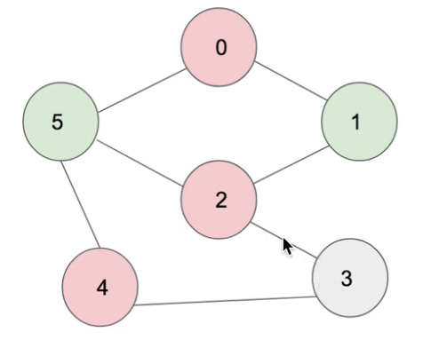

# Sumary

### DFS
#### number of islands. 
Just like your Fun Project. 


### Dynamic Programming
The very definition is to use previous knowledge to compute a current value. So the key is to think how to build your way to each step. 
A typical problem is the [0-1 knapsack problem](https://www.youtube.com/watch?v=xCbYmUPvc2Q). And it can be easily implemented as a 2D array

**Key idea for DP:** Sometimes, even though the problem asks to go for one specific value, you might be able to build your sub-problems by going 
from 0 to that value. 

Actually, for the classic knapsack problem, you can use an 1d array to solve the problem, bottom up
```c++
int knapsack(int val[], int wt[], int n, int W)
{   //val[] are values, wt[] are weights, n is the number of items, W is target weight. 
    int dp[W+1];
    memset(dp, 0, sizeof(dp));
    for(int i=0; i < n; i++) 
        for(int j=W; j>=wt[i]; j--)
            dp[j] = max(dp[j] , val[i] + dp[j-wt[i]]);
    return dp[W];
}
```
Reason why this algorithm works:
1. knapsack requires you to be able to
  - keep best values of their corresponding weights as they are if your current weight is higher.   
  - your max value will be max(old_value(target_weight), item_value+old_value(target_weight - item_weight))
2. bottom up approach allows you to: 
  - not touch best values if your current weight is higher (j>=wt[i])
  - allows you to read old_value(target_weight), dp[j] and old_value(target_weight - item_weight)), (dp[j-wt[i]])), since this is 
  bottom up approach. 
  
####Distance To the Nearest 0  
[Problem](https://leetcode.com/problems/01-matrix/)
```
[011111011]
```
You just need two passes to find the minimum value from one direction: left to right: [0,1,2,3,4...0, 1,2], right to left:[0,1,2...3,2,1,0,1,2]
Rationale is you get the min from both directions, which is to **improve** based on what you have. 

In the 2D case, you can check left, up, then right, down. 

### BFS 
#### Distance To the Nearest 0  
[Problem](https://leetcode.com/problems/01-matrix/)
you can use a queue and keep adding and popping nodes to achieve BFS. The rationale is similar to the [DP solution ](#Distance-To-the-Nearest-0)
which is: you will get the right result after evaluating by getting the best of multiple passes. 
In 1D case, in each pass you evaluate 1 by starting from the 0 on the left/on the right. This is same as DP, which evaluates from 0 on the left & on the right as well.   
  
### Graph 

#### Topological Sort
https://leetcode.com/problems/course-schedule-ii/

Used in Software IDE build system, apt-get (packaging tool)

#### Bi-partition Problems: 
If a problem asks you to classify two types of nodes, and adjacent nodes cannot be in the same color, then it's bi-partition. 



Use the **FULL edge list**, and **DFS** for this problem. Otherwise, there will be too bugs for you to consider!!
Corner case: empty edge list. 

#### Cycle Detection
You can have 2 methods: topological sort, or building 2 edge lists (one with inbound and one with outbound edges). 
Then, you can start popping edges on one edge list, from all leaf nodes. If there are no edge left at the end, the graph is clear. 
``


## Useful Tips
1. Take whiteboard marker, eraser, pens, resumes to avoid las pendejadas. Nobody cares about your performance except for yourself. 
2. Quickselect... The partitioning algorithm is too hard to implement. Try the simple one (heap) first, and mention that in your comment. 
**This is because they sometimes just want to see how you think, not exactly how good your code is.**
3. Do not say: can I do DP? Like you're asking for permission. You should discuss alternatives. 


##Tips for your career
1. Make your work public, and advertise it. The validation of your work is important. 
2. **Do the work that has a clear market-value goal!!**. Then, **do well so that people can count on you**.
That's how you make an impact. 